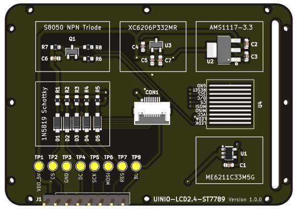
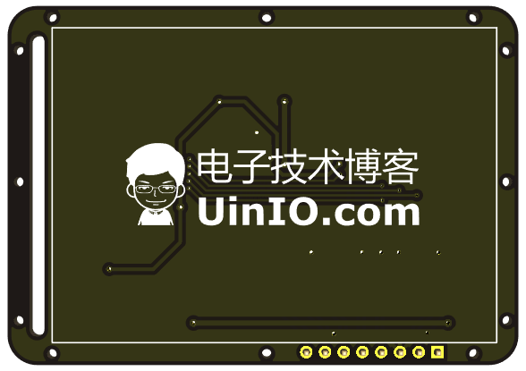

# UINIO-LCD2.4-ST7789

基于 `240 * 320` 分辨率的 **2.4** 英寸 **GMT024-01** 裸屏(焊接版) 的 PCB 底板硬件方案。

- 同时采用了 3 款线性稳压器方案（**ME6211C33M5G-N**、**AMS1117-3.3**、**XC6206P332MR**），便于利用现有物料进行贴装；
- 板载了 **SPI** 总线调试用的**测试点**，也便于在无插接件的情况下，直接用导线进行连接；
- 提供了 `8Pin` 的 FPC 插座以及 `2.54mm` 排针接口；
- 项目 `CAD` 目录下存放的是 `.dxf` 板框设计文件，可以在不影响外形轮廓的情况下折叠 FPC 排线；
- 预留有 `1mm` 的固定螺丝孔，便于产品原型的搭建；
